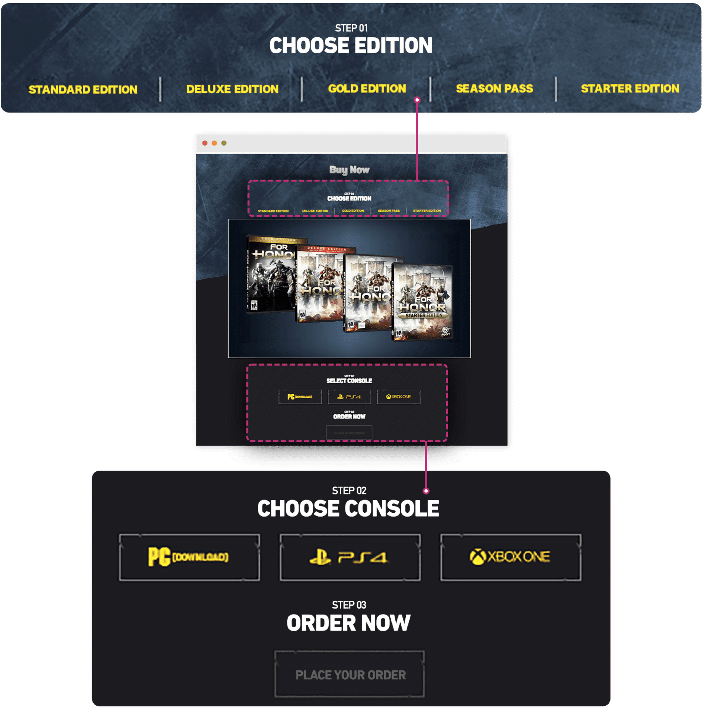
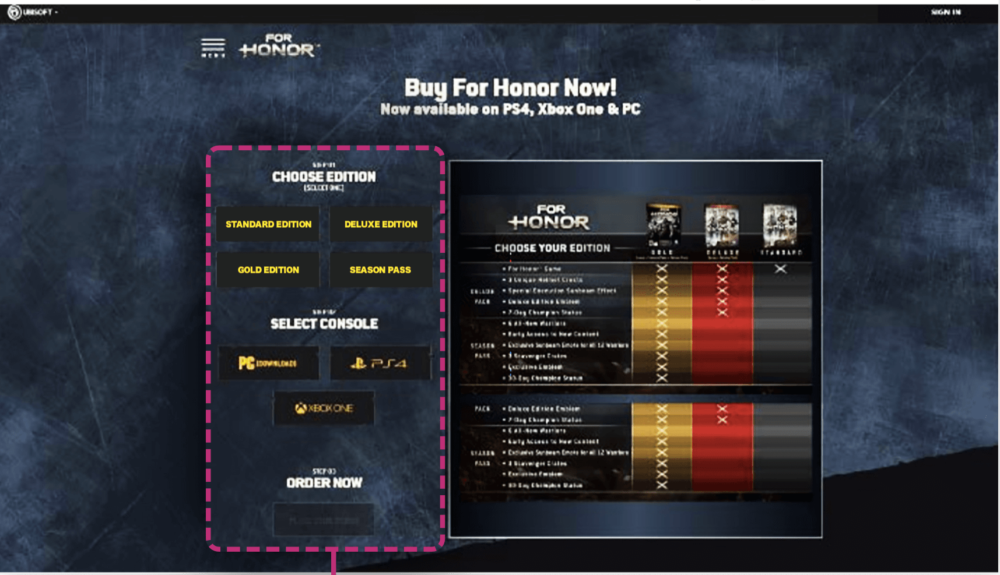
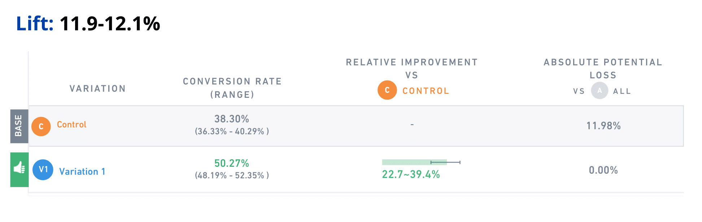
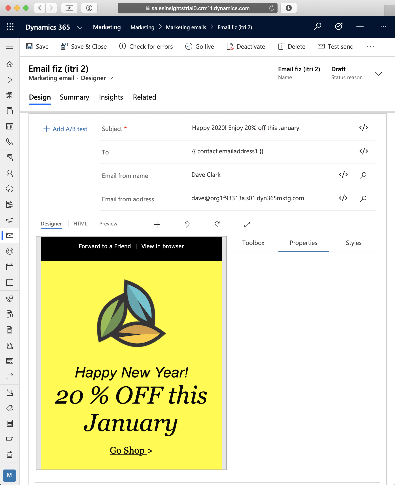
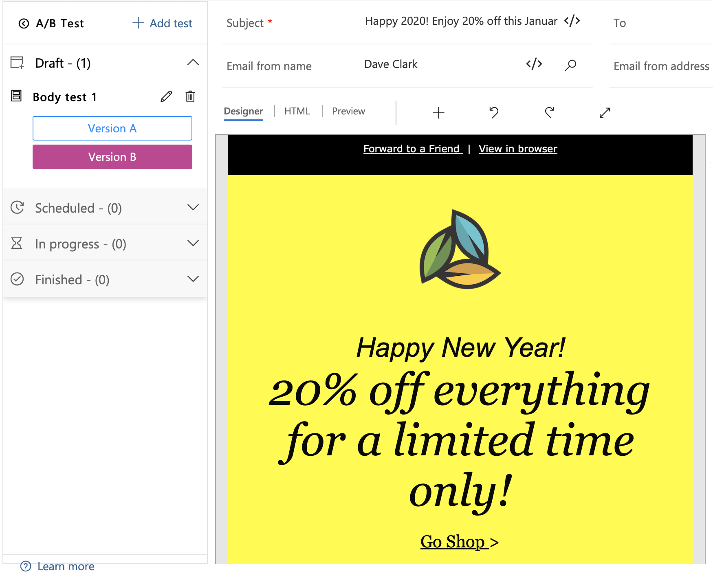
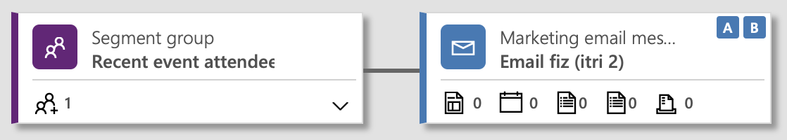
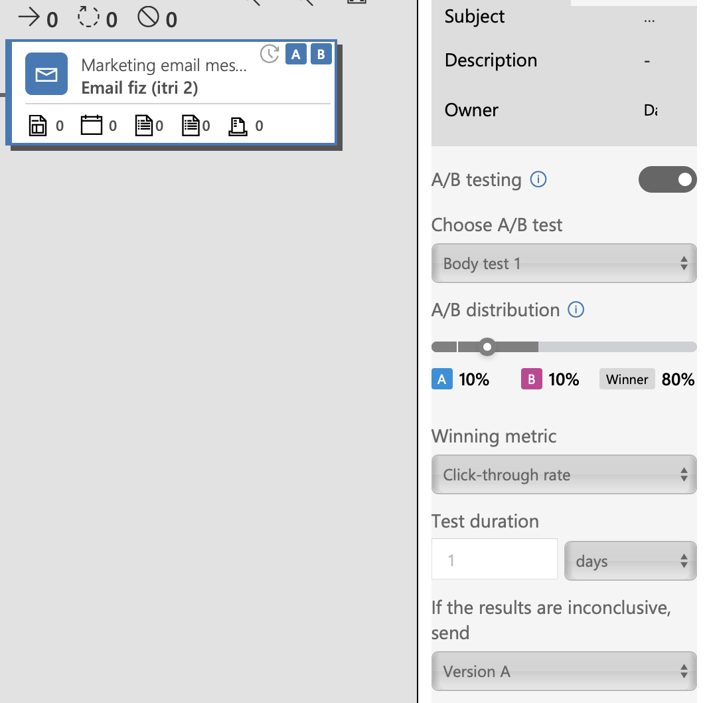

    

Netflix even A/B test images used for film titles, drawing the gaze of their viewiers to new blockbuster films, getting that first click resulting in more minutes watched for films and providing a better user experience. 

In fact Netflix say A/B testing a title image sometimes results in **20% to 30% more viewing for that title.** [Source](https://variety.com/2016/digital/news/netflix-ab-tests-image-optimization-trick-1201674325/).

So **what is A/B testing**? **How can Dynamics 365 and Power Platform benefit** from it? 

## Introduction

This post starts by **explaining what A/B testing is**. It then looks at **a use case and success story from a big tech firm** to help justify why we, as Power Platform consultants and developers, should care about this tool. 

We then **walkthrough an example in Dynamics 365** *already available* to us, to help **drive marketing success**.

Finally we consider other **ways A/B testing can be used in Dynamics** to **engage end users** for early user adoption and project success and ongoing **productivity increases**.

## What is A/B testing?

The concept behind A/B testing is to create a control group and one or more experimental groups and provide them different versions of a product. We can then **track metrics** against each group, such as: 

- Quantity of data filled in on a Dynamics 365 form
- Time taken to open and save a form
- Click throughs in a marketing emails

Any key metric to help decide which version of the product is more successful.

Have you ever been in a requirements meeting where **stakeholders disagree on layout for a form on an app?** With A/B testing we can **decide product changes based on data**, rather than the loudest stakeholder.

## Real-life success story

Ubisoft are a video game publisher based in Paris. You may have heard of them or some of their games including Assassin's Creed, Far Cry and Tom Clancy's Splinter Cell.

While releasing a new game, For Honor, Ubisoft created **two versions of the game's 'Buy Now' page**, and **collected data on each page's success** during the holiday season (Oct - Dec 2017).

### Before the testing phase:

The hypothesis was that the **buying process could be simplified by reducing the need to scroll** on this page. As the image above shows, before the buyer would have to select their preferred game edition, scroll down, select their console, scroll down, then place their order and enter their payment details.

### After the testing phase:

This new version removes the need to scroll as all buying options are selectable in a single column. Comparing test data between the two layout versions demonstrated a **12% increase in lead generation**.

You can read the full case study [here](https://vwo.com/success-stories/ubisoft-ab-testing-lead-generation/). But stick around for the fun bit of this post first: A/B testing in Dynamics 365.

## A/B testing in Dynamics 365 for marketing success

Designing the perfect marketing email can be tough. Perhaps you have a few similar ideas floating around for the email subject, the imagery or the wording. You might be ok deciding which to choose based on intuition or past experience. 

Or, you might **use A/B testing to find out which of a few similar designs performs the best** on a subset of your audience. Then **send the successful candidate** to the remainder of your audience. As we've seen from earlier examples, **basing design decisions on data**, rather than a hunch, could be the smart move to ensure success.

### Example walkthough in Dynamics 365 for Marketing

In this example we create two versions of a marketing email, version A and version B. We then enable the A/B test feature in Dynamics 365 for Marketing on my marketing emails. We'll see what Dynamics 365 can offer us in terms of:
- A/B test configuration options
- Performance metrics
- Test results data display

To create a marketing email you can follow <a href="https://docs.microsoft.com/en-gb/dynamics365/marketing/email-design" target="_blank">this Microsoft guide</a>.

Here's one I prepared earlier:

With a marketing email created, we can press the **Add A/B test** button shown to the left of the subject field in the screenshot above. Select to **test against changes to the email body, the from name or the email subject**.

In my example 'Version B' changes the wording in the email body slightly:

> For full details on how to configure email templates for A/B testing in Dynamics, refer to Microsoft's documentation <a href="https://docs.microsoft.com/en-gb/dynamics365/marketing/email-a-b-testing" target="_blank">here</a>.

Now we're ready to test our emails using a customer journey. Here Microsoft's documentation notes the following:

> To produce reliable test results, you should always send each version (A and B) to a minimum of 100 recipients before allowing the system to choose a winner. A typical recommended setup would use a 1,000-member segment (or larger), with a test distribution that sends version A to 10% of the segment, version B to another 10%, and then sends the winning design to the remaining 80%.

My journey simply has two steps: first it selects a subset of my contact base (recent event attendees) and then send them the marketing email I just created. 

To use the marketing email created earlier, select the marketing email message tile in the journey, then select properties on the right and select your new message in the 'Marketing email message' lookup field.

In the properties pane you'll also be able to specify A/B test distribution, **winning metric** and **test duration**:

With that configured I can click 'Go Live' in the command bar. Then I play the waiting game! Note that 1 day was specified as the test duration. During this time I can scroll down to the **data** panel test-

Once the test duration is up, there should be a clear winner: in this case **the version of the email body that received the most click-throughs**. The remaining 80% of my contact-base can then be sent the more successful version of my marketing email.

> My test email has only been sent to one person (me) as a trial, not the production-level 100 recipients recommended by Microsoft. The screenshot is still illustrative of the information we can track: sent rate, delivered rate, unique opens and clicks. Similar to Google Analytics or ClickDimensions. **Note**: ClickDimensions also supports <a href="https://support.clickdimensions.com/hc/en-us/articles/115001157453-Email-Send-Split-A-B-Testing" target="_blank">A/B testing</a>.

## What next for A/B testing in Dynamics 365?

At the time of writing, marketing emails in Dynamics 365 is the only module supporting A/B testing. But if you've read this far you must be thinking: **why stop there**? 

### Idea #1: Dynamics 365 form analysis with Azure Application Insights

Hypothesis: by **providing subsets of users with different versions of a similar form** (e.g. a complex customer service form), we can **use Azure Application Insights (AAI) to determine which is the more productive form** and therefore **increase team productivity**. This A/B test scenario would work as follows:

 - Two subsets of the customer service team would be given a unique security role
 - Two new customer service (case) forms would be created; each similar but one with changes we hypothesise to be more productive
 - Each form is delivered to a separate user subset using <a href="https://docs.microsoft.com/en-us/power-platform/admin/assign-security-roles-form" target="_blank">security control access</a>
 - AAI and <a href="https://docs.microsoft.com/en-us/office365/admin/usage-analytics/usage-analytics?view=o365-worldwide" target="_blank">usage analytics</a> can be used to measure performance metrics of the users and determine which form is more successful (more productive for our users)
 - The **more successful form is then be rolled out to all users** in the customer service team

### Idea #2: Dynamics Portals with Google Optimise

**Google Analytics** is installed on most portals these days. It helps track performance and usage statistics for how users are responding to our portals.

What seems to be less widely used is **Google Optimise**: a tool from Google offering a data-driven approach to understanding how continuous UX improvements can be made to a portal to create the best experience for our users. Google describe Optimise as:

> Optimise is natively integrated with Analytics to help you identify which parts of your site need improvement. Use your Analytics site data to quickly and easily identify problem areas, then turn those insights into action to deliver an online experience that works best for your customers.

Optimisation tools are too often reserved for increases in marketing performance, often neglecting the benefits to be found from optimising forms used by our end users. Dynamics portals are often used as a marketplace with a checkout, but sometimes they're an external window into Dynamics 365 used by administators. 

Google Optimise uses A/B testing and makes it even simpler to derive insights into how we can increase productivity for end users using our portals. Given this new simplicity I think it's time productivity is given more of a consideration when it comes to optimisation, rather than solely focusing on marketing gains.

### Moving forward

I'd like to explore the above points further in future article posts, for now though they will have to live as ideas. Perhaps you have **your own ideas for how A/B testing could be used to enhance user experience** of Power Platform apps and Dynamics 365?

## Conclusion

We've seen that A/B testing is used to great effect by tech companies with large enough audiences to split test against. Dynamics 365 for Marketing employs A/B testing for teams with a large target audience of leads or contacts is mass emailing situations. New marketing campaign emails are first trialled against subsets of recipients, success metrics analysed, and a winning email layout chosen to be sent to the remaining audience. This allows **email marketing design decisions to be based on empirical evidence** rather than intuition.

A/B testing can be used to **enhance the user experience of Dynamics 365**, assuming there is a large enough set of users to test against. **Google Analytics** and **Azure Application Insights** measure key performance indicators of Dynamics product changes such as form layout and process flows. This can form an **evidence-based approach to determining which product changes are more productive for our users**, and should therefore be rolled out to our entire user base.