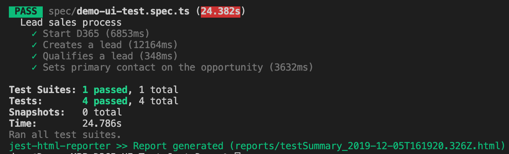

<div class="heading">

</div>

##Introduction

If you read [part one](https://daveclark.io/article/22-11-19) of this series, you might be expecting an article about **Behaviour Driven Development** (BDD).

Unfortunately, [DigitalFlow](https://github.com/DigitalFlow) (author of [Xrm-WebApi-Client](https://github.com/DigitalFlow/Xrm-WebApi-Client)) had other ideas. He's released an open-source project that could be a game changer for automation testing PowerApps, Dynamics 365 and Dynamics 365 Portals. It's a project that steps away from the convention of Selenium, EasyRepro and C# and gives us the tools to write automation tests in **TypeScript**.

> Note: part 3 of this series will still cover BDD!

##Why's this important?

First and foremost, it provides the community with an alternative: **not every software house is full of .NET developers** i.e. the type of developers needed to write automation tests with the popular tool [EasyRepro](https://crmbusiness.wordpress.com/). Or if they are, perhaps the .NET developers are always busy.

This new tool **empowers the teams of client-side coders, front-end developers and TypeScript experts** who want to automate their Power Platform testing pipeline.

More teams working with community automation testing tools will mean our tools continue to grow through code contributions. This in turn should lead to lower defect rates and more polished products being delivered to happy customers.

##Automation testing is now more important than ever

[Ben Hosking](https://crmbusiness.wordpress.com/) made a point to me recently that really stuck. As you know in July 2018, Microsoft announced the modernised [continuous delivery model](https://cloudblogs.microsoft.com/dynamics365/bdm/2018/07/06/modernizing-the-way-we-update-dynamics-365/) for Dynamics 365 updates. Now, all Dynamics 365 customers live on _the same version_ and receive _two forced major updates_ per year.

**What does this mean for testing?**

It means **our Dynamis 365 environments have got to be ready for each release**. At the flick of a switch\* we've got to be able to upgrade our environments and tese that they **still work as expected, free from defects**.

> \* There is a window of opportunity to validate major updates in a sandbox environment before upgrading production.

A pertinent example would be the [Unified Interface](https://docs.microsoft.com/en-us/power-platform/admin/about-unified-interface). As organisations continue to upgrade their Dynamics 365 [model-driven apps](https://docs.microsoft.com/en-us/powerapps/maker/model-driven-apps/model-driven-app-overview) to the new interface, those with automation test suites built against their business processes can **automatically know if the update has introduced regression defects**, and where to find them.

##Demo: building automation tests with TypeScript

As mentioned at the beginning, this technology is thanks to DigitalFlow and a new project of his called **D365-UI-Test**. [The project](https://github.com/DigitalFlow/D365-UI-Test) is self-described as:

> A UI testing framework for easy and robust UI testing in Dynamics 365 CE and Dynamics 365 Portals. It is powered by TypeScript and Puppeteer.

In addition, the project comes with a sibling repository called **D365-UI-Test Jest Demo** to help us in getting started, and is where my walkthrough begins here.

> Note: this walkthrough assumes a basic understanding of [npm](https://www.npmjs.com/) and [git](https://git-scm.com/).

##Walkthrough

First, clone the repository using:

```
git clone https://github.com/DigitalFlow/D365-UI-Test-Jest-Demo.git
```

Open the repository in a code editor or navigate to its root in the terminal. Install the repository's dependencies by running:

```
npm ci
```

Now that we've downloaded the repository and installed its dependencies, we need to **configure its connection to our environment**.

Create the file `C:\temp\settings.txt`. If you'd prefer to create a settings file in your project's root, then you'll need to change the line of code responsible for loading the file in your tests.

> If you're happy using your C:\ drive then skip this step.

Open `spec/demo-ui-test.spc.ts` and change the line:

```ts
const config = fs.readFileSync("C:/temp/settings.txt", { encoding: "utf-8" });
```

to this:

```ts
const config = fs.readFileSync(path.resolve(__dirname, "../settings.txt"), {
  encoding: "utf-8",
});
```

You're also going to want to add `settings.txt` to your `.gitignore` file to stop your credentials from being uploaded to source control.

Now edit `settings.txt` with your environment's URL, your user name and your password each delimited by a comma as follows:

```txt
https://orgname.crm4.dynamics.com,username@d365uitest.onmicrosoft.com,yourpassword
```

You should now be able to run your tests using:

```
npm run test
```

When you run this command, a browser should open up and automatically sign into your Dynamics 365 environment. At the time of writing, the D365-UI-Test demo repository also comes with a starter test:

```ts
test("Open new account form", async () => {
  await xrmTest.Navigation.openCreateForm("account");
});
```

This test, of course, just opens an account form:

<video width="100%" controls>
    <source src='https://i.imgur.com/ZEsP4QX.mp4' type="video/mp4">
</video>

**Let's write some more tests to explore the repo's capabilities**. The following example:

- Opens a Dynamics 365 environment
- Creates a lead (setting all mandatory fields)
- Qualifies the lead
- Asserts that an opportunity is created
- Asserts that a contact is automatically created and associated with the opportunity

Step one, opening a Dynamics 365 environment, has already been done for us:

```ts
test("Start D365", async () => {
  const config = fs.readFileSync(path.resolve(__dirname, "../settings.txt"), {
    encoding: "utf-8",
  });
  const [url, user, password] = config.split(",");

  page = await xrmTest.open(url, { userName: user, password: password });
});
```

To create a lead, we can add the following test:

```ts
test("Creates a lead", async () => {
  // Open the create new lead form
  await xrmTest.Navigation.openCreateForm("lead");

  // Enter mandatory values
  await xrmTest.Attribute.setValue("subject", "Shipment of mince pies");
  await xrmTest.Attribute.setValue("firstname", firstName);
  await xrmTest.Attribute.setValue("lastname", lastName);

  // Save the record
  await xrmTest.Entity.save();

  // Assert that the lead has been created. Get its ID and check that it's a valid Guid.
  return await xrmTest.Entity.getId().then(id => expect(id).toMatch(guidRegex));
});
```

Note: `firstName`, `lastName` and `guidRegex` are constants I've defined at the beginning of my `describe()` function:

```ts
describe("Lead sales process", () => {
  const firstName = "Jim";
  const lastName = "Merchant";
  const guidRegex = /^(\{){0,1}[0-9a-fA-F]{8}\-[0-9a-fA-F]{4}\-[0-9a-fA-F]{4}\-[0-9a-fA-F]{4}\-[0-9a-fA-F]{12}(\}){0,1}$/gi;
  ...
}
```

To qualify a lead, we can write the following:

```ts
test("Qualifies a lead", async () => {
  const qualifyButton = await Promise.race([
    page.waitForSelector("li[Command$='ConvertQuick']"),
    page.waitForSelector("li[id*='ConvertQuick']"),
  ]);

  if (!qualifyButton) {
    throw new Error("Failed to find qualify button");
  }

  // Click qualify button in the command bar.
  await qualifyButton.click();
});
```

Finally, once the lead has been qualified, wait for the opportunity form to load and assert that the primary contact has ben set to an automatically created contact.

```ts
test("Sets primary contact on the opportunity", async () => {
  // Wait for the new opportunity record to load.
  await page.waitForSelector("li[id*='parentcontactid']");

  // Assert that a parent contact was automatically created and associated with the opportunity.
  const contact = await xrmTest.Attribute.getValue("parentcontactid");
  const contactName = contact[0].name;

  expect(contactName).toBe(`${firstName} ${lastName}`);
});
```

## The results

Here's how that looks when I execute `npm run test` now:

<video width="100%" controls>
    <source src='https://i.imgur.com/EVhUUV6.mp4' type="video/mp4">
</video>

Once our tests have run we receive a summary in our console:



##A few points

Firstly, you'll notice the tests have to run sequentially for this to work. To achieve this, change the `test` script in `package.json` to:

```json
"test": "jest --runInBand"
```

In a more thorough example, we might make our tests self-contained so that they can be run in parallel to save time.

Secondly, you may have noticed the code to qualify a lead is quite cumbersome:

```ts
const qualifyButton = await Promise.race([
  page.waitForSelector("li[Command$='ConvertQuick']"),
  page.waitForSelector("li[id*='ConvertQuick']"),
]);

await qualifyButton.click();
```

At the time of writing, there's no function in **D365-UI-Test**'s API for qualifying a lead, like there is for say deleting a record with `xrmTest.Entity.delete()`. But not for long! Because the project is open-source, **I can submit a pull request and contribute** to the author's work.

##Conclusion

Forced updates to our Dynamics 365 environments are becoming more regular. Customisations need to **withstand breaking changes** and depracation by being reinforced with testing suites that **validate updates haven't introduced regression defects**.

Popular automation testing frameworks for the Power Platform such as EasyRepro go a long way to supporting the community in this area. However, for the teams who:

- are more proficient in TypeScript than C#
- want to write platform-agnostic code (EasyRepro relies on the .NET framework)
- want to support up-and-coming open-source projects

then I think you should consider writing automation tests for your Power Platform apps using TypeScript and [D365-UI-Test](https://github.com/DigitalFlow/D365-UI-Test).
