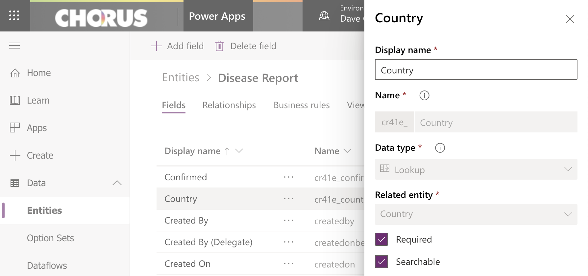
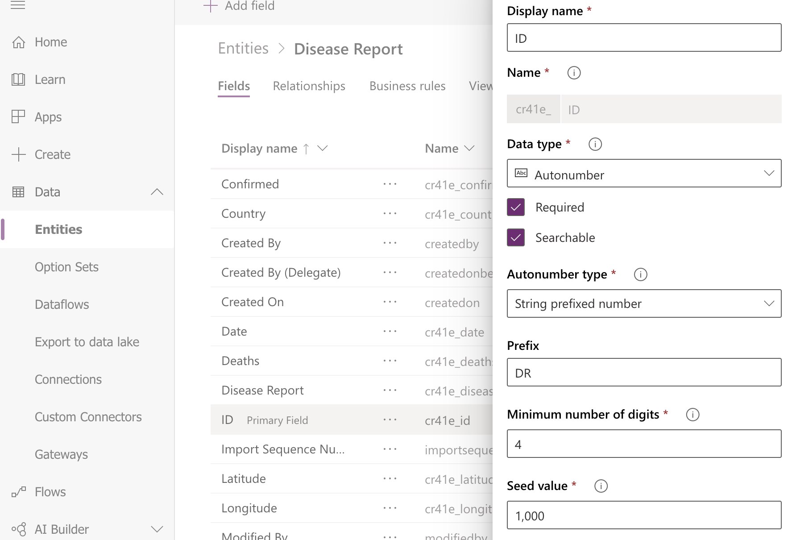

    

## Introduction

The importance of rich data can't be overstated when demoing **Dynamics 365** and **Power BI**. Chris Huntingford's [UFO sighting-inspired demo](https://www.youtube.com/watch?v=po4jh6D0SLc) of a full Power Platform solution build shows this, and also serves as the inspiration for this article. Today we're going to:

1. Create a **Model-driven app** in Dynamics 365 to store open source data on the spread of the Covid-19 virus

2. Build a **Power BI report** to analyse the spread of the virus and **embed it in a dashboard** in our app

## The Guide

> This guide assumes you've **never** built a Power App before. It even explains how to get a **free community plan environment** to start making apps!

### Topics covered

1. How to **create entities** in the [Common Data Service](https://docs.microsoft.com/en-us/powerapps/maker/common-data-service/data-platform-intro)

2. Considerations when **importing data**

3. Building a **model-driven app** in Dynamics 365, including **views**, **charts** and **navigation**

4. Creating rich **reports to analyse data** in **Power BI**, and how to share/embed reports

### Step 1: Spin up your free environment

Follow [this link](https://powerapps.microsoft.com/en-us/communityplan/) to **provision your environment** for individual use so you can **start building Power Apps**. For more detail, you can [watch this brief but detailed video](https://www.youtube.com/watch?v=VyrjpdVm_Ko) from Lisa Crosbie for a step-by-step demonstration.

### Step 2: Download the data

You can download the xml data you'll need to import into Dynamics 365 from [this link](https://gist.github.com/camelCaseDave/299a9129e7eec3640053cd63b03cf49f).

If you want to **check out the data first**, you can **download the excel** version [here](to do). If you do, you'll get some insight into how we're about to structure our database so that it can hold the data.

> Looking at the data set we can see that we'll need to build an entity in our Common Data Service environment that can store the columns 'Province/State', 'Country/Region', 'Date' and so on.

> Once you've had a look be sure to save the sheet in xml or csv format so it can be imported later.

### Step 3: Create your data structure

First open the environment you made in step 1 (if the browser tab is still open), or go to [make.powerapps.com](https://make.powerapps.com) and sign in with the account you used earlier. Make sure you've selected your personal environment (the one with your name in it) in the top right of the window.

Now we're going to build two entities to hold the data:

1. **Country**

Go to Data > Entities > New entity. Enter the display name 'Country', tab through the remaining options and press 'Create'.

2. **Disease Report**

Create the entity as you did for Country, except change the primary field from 'Name' to 'ID'. Once that's created we need to add a few more fields to the entity so it matches the data in the excel sheet. Those fields and their data types are:

1. Confirmed (Whole Number)
2. Date (Date Only)
3. Deaths (Whole Number)
4. Latitude (Floating Point Number)
5. Longitude (Floating Point Number)
6. Province/State (Text)

To create each a field first make sure you've naigated to Data > Entities > Disease Report, then press 'Add field' in the command bar. Enter the name and data type I've listed above.

Two final steps are needed before we can **import the data**. 

First, create one last field called Country with a data type of Lookup (select Country as the related entity):

Then open the ID field and change it to an **autonumber** type. This will generate a readable unique identifier for each disease report when they get imported into Dynamics 365:

### Step 4: Import the data

todo:

export country list
upload country list xml to github gist include link above
screenshot how to import data and view in app
step 5 create an app, add columns to views
step 6 power BI report, consider relative dates
step 7 embed power BI report (including sys admin tickbox screenshot)
step 8 view report in app, share report

conclusion

next part more of the power platform
 power automate with forms pro
 screenshot of whole stack
