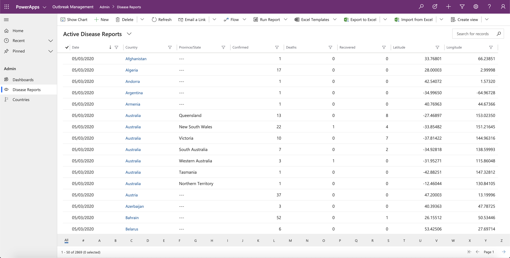
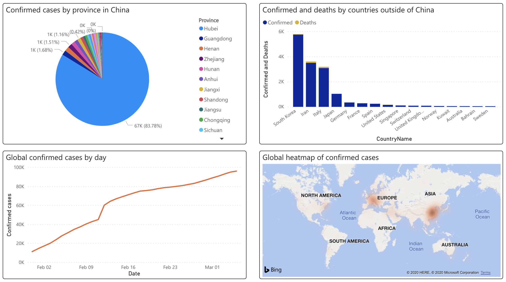
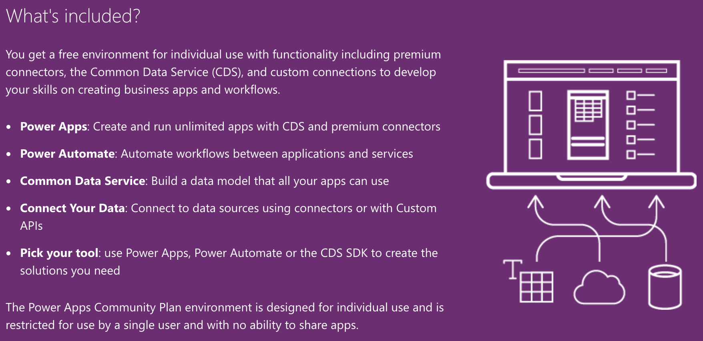
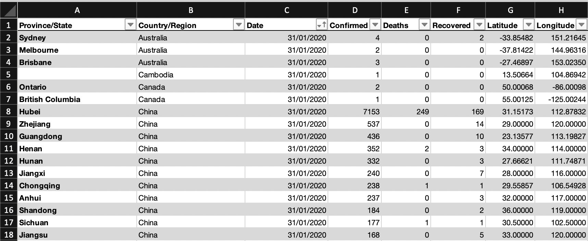
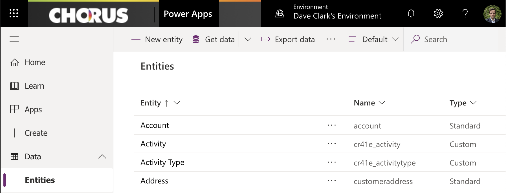
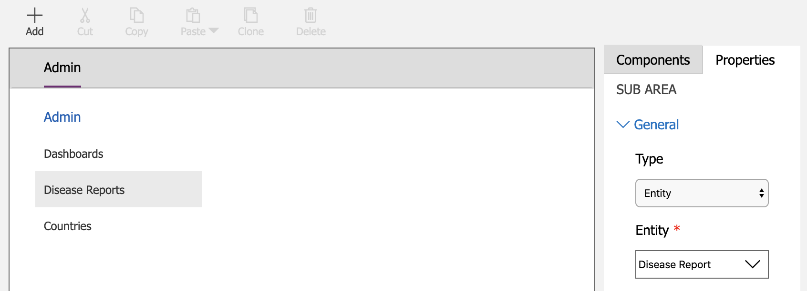
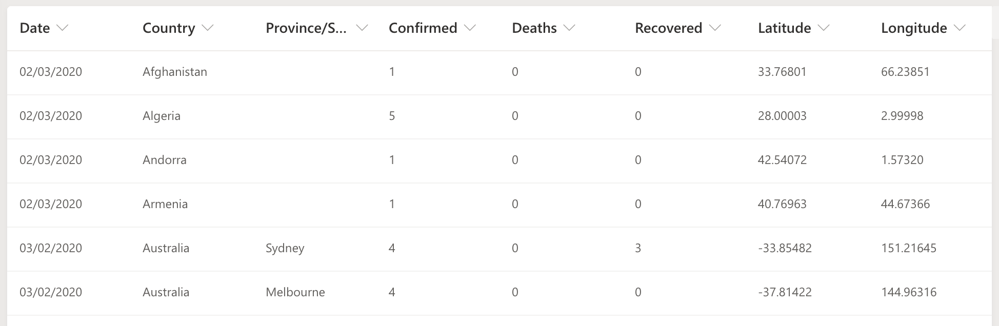
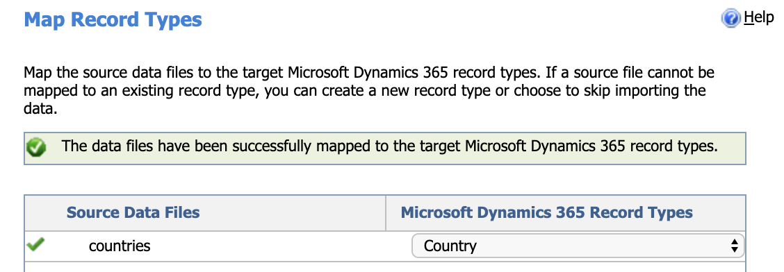
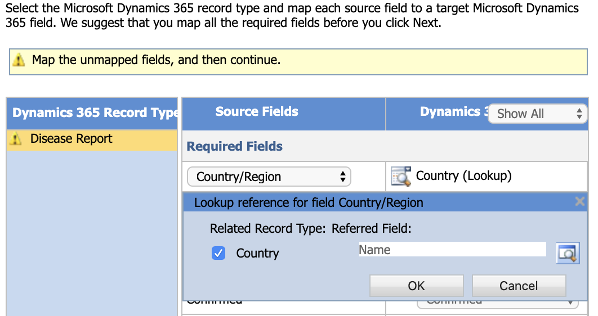

    

## Introduction

The importance of rich data can't be overstated when demoing **Dynamics 365** and **Power BI**. Chris Huntingford's [UFO sighting-inspired demo](https://www.youtube.com/watch?v=po4jh6D0SLc) of a full Power Platform solution build shows this, and also serves as the inspiration for this article. In this article I use **data on the spread of Coronavirus (Covid-19)** to showcase the agility of app creation and reporting capabilities of **Microsoft Power Platform**.

Today we're going to:

1. Create a **Model-driven app** in Dynamics 365 to store open source data on the spread of the Covid-19 virus

2. Build a **Power BI report** to analyse the spread of the virus and **embed it in a dashboard** in our app

## The Guide

> This guide assumes you've **never** built a Power App before. It even explains how to get a **free community plan environment** to start making apps!

### Topics covered

1. How to **create entities** in the [Common Data Service](https://docs.microsoft.com/en-us/powerapps/maker/common-data-service/data-platform-intro)

2. Building a **model-driven app** in Dynamics 365, including **views**, **charts** and **navigation**

3. Considerations when **importing data**

4. Creating rich **reports to analyse data** in **Power BI**, and how to share/embed reports

### Step 1: Spin up your free environment

Follow [this link](https://powerapps.microsoft.com/en-us/communityplan/) to **provision your environment** for individual use so you can **start building Power Apps**. For more detail, you can [watch this brief but detailed video](https://www.youtube.com/watch?v=VyrjpdVm_Ko) from Lisa Crosbie for a step-by-step demonstration.

### Step 2: Download the data

You can download the disease report data you'll need to import into Dynamics 365 from [this link](https://gist.github.com/camelCaseDave/299a9129e7eec3640053cd63b03cf49f).

You'll also need to download a list of countries from [this link](https://gist.github.com/camelCaseDave/afa55074922980300f7a141393bb3149).

If you want to **check out the data first**, you can **download the excel** version [here](to do). If you do, you'll get some insight into how we're about to structure our database so that it can hold the data.

> Looking at the data set we can see that we'll need to build an entity in our Common Data Service environment that can store the columns 'Province/State', 'Country/Region', 'Date' and so on.

> Once you've had a look be sure to save the sheet in xml or csv format so it can be imported later.

### Step 3: Create your data structure

First open the environment you made in step 1 (if the browser tab is still open), or go to [make.powerapps.com](https://make.powerapps.com) and sign in with the account you used earlier. Make sure you've selected your personal environment (the one with your name in it) in the top right of the window.

Now we're going to build two entities to hold the data:

1. **Country**

Go to Data > Entities > New entity. Enter the display name 'Country', tab through the remaining options and press 'Create'.

2. **Disease Report**

Create the entity as you did for Country, except change the primary field from 'Name' to 'ID'. Once that's created we need to add a few more fields to the entity so it matches the data in the excel sheet. Those fields and their data types are:

1. Confirmed (Whole Number)
2. Date (Date Only)
3. Deaths (Whole Number)
4. Latitude (Floating Point Number*)
5. Longitude (Floating Point Number*)
6. Province/State (Text)

> \* When configuring these fields, set maximum value to be over 1000, minimum value to be less than -1000 and  decimal places to 5.

To create each a field first make sure you've naigated to Data > Entities > Disease Report, then press 'Add field' in the command bar. Enter the name and data type I've listed above.

Two final steps are needed before we can **import the data**. 

First, create one last field called Country with a data type of Lookup (select Country as the related entity):

Then open the ID field and change it to an **autonumber** type. This will generate a readable unique identifier for each disease report when they get imported into Dynamics 365:

### Step 4: Create the app

Now that we've created our data structure **it's time to build a [model-driven app](https://docs.microsoft.com/en-us/powerapps/maker/model-driven-apps/model-driven-app-overview)**. Model-driven apps don't require code and are laid out **based on the components we add to it** (in our scenario that'll be the Country and Disease Report entities we made earlier). Within the app we'll be able to maintain and report on our data.

From [make.powerapps.com](https://make.powerapps.com) go to Apps > New app > Model-driven. Give your app a name (e.g. Outbreak Management) and then press Done.

With the App Designer open, it's time to **add components** to the app. Select 'Entities' under 'ARTIFACTS' in the top right, then search for and add the entities we made earlier: **Country** and **Disease Report**.

Now that the app has components, we can build a site map (navigation for the app). Click the edit button beside 'Site Map'.

For your site map layout, I'd suggest having 3 sub areas: **Dashboards**, **Disease Reports** and **Countries**. To add a sub area, click 'Add' at the top of the sitemap designer, then select the sub area type (in the properties tab on the right) which will be either 'Dashboard' or 'Entity'.

Save and close the sitemap designer once your sitemap is laid out, then press 'Publish' in the app designer. Now you can press 'Play' in the top right to see how your app looks!

## Step 5: Investigate your app

If you check the **navigation pane** running down the left of your app, the layout should be the same as how you configured it in the designer.

Select 'Disease Reports' from the navigation pane to open up a view of all active Disease Reports in your database. You'll probably notice two things:

1. The default view of Disease Reports is rather lacking. Where are the column headers for fields we created earlier such as 'Deaths', 'Confirmed' and 'Recovered'?

2. There's no data in the database yet!

Let's fix both those things. Once we have, **we'll be ready to build Power BI reports** off our data.

## Step 6: Configure views for your app

To edit views go back to [make.powerapps.com](https://make.powerapps.com) and then navigate to Data > Entities > Disease Report > Views. Click 'Active Disease Reports' to edit that view first.

Updating the view is as simple as **dragging fields from the left pane into the view** (middle pane). Once in the view, drag columns left and right to reorder them as desired. Here's how I laid out my view:

Hit 'Save' then 'Publish' in the top right, then 'Back' in the top left. 

To test your changes go to Apps and select the app you made earlier. Select 'Disease Reports' in the left navigation as we did in **Step 5** and you should see that the view 'Active Disease Reports' now has several columns.

## Step 7: Import some data

With your app open press the cog igon in the top right, then select 'Advanced Settings'. Then select 'Settings' in the top navigation bar and 'Data Management'. Select 'Imports' then 'IMPORT DATA' from the ribbon bar. 

> Note: it is possible to import data through the modern interface in [make.powerapps.com](https://make.powerapps.com), though at the time of writing, it doesn't seem to be supported when using a community plan environment.

Select the Country xml file you downloaded in Step 2 then press 'Next' at the bottom a few times until you're prompted to **map the source data file to a record type in Dynamics 365**:

Press Next until the end and Submit the data for import.

Follow the process again from selecting 'IMPORT DATA' in the ribbon, except this time select the Disease Report xml downloaded in Step 2.

Mapping fields for Disease Reports is slightly more complicated. Once you arrive on the 'Map Fields' screen you'll notice most fields are mapped automatically. This is because the **column header names in the xml file identically match the field labels in Dynamics 365**. One exception is 'Country/Region' which is just labelled 'Country' in Dynamics 365, so we'll map that manually:

Press 'Next' all the way through the data import wizard and submit the file for import. Now back on the Data Management view of 'My Imports' you can monitor the status of the two file imports.

> You can press the refresh icon in the top right of the view intermittently to wait for the 'Status Reason' column values to change to 'Completed'.

Once both are complete, select the down arrow beside 'Dynamics 365' in the top navigation bar, then select your app. 

Voila! Your app now has data:

step 6 power BI report, consider relative dates
step 7 embed power BI report (including sys admin tickbox screenshot)
step 8 view report in app, share report

conclusion

next part more of the power platform
 power automate with forms pro
 screenshot of whole stack
