

    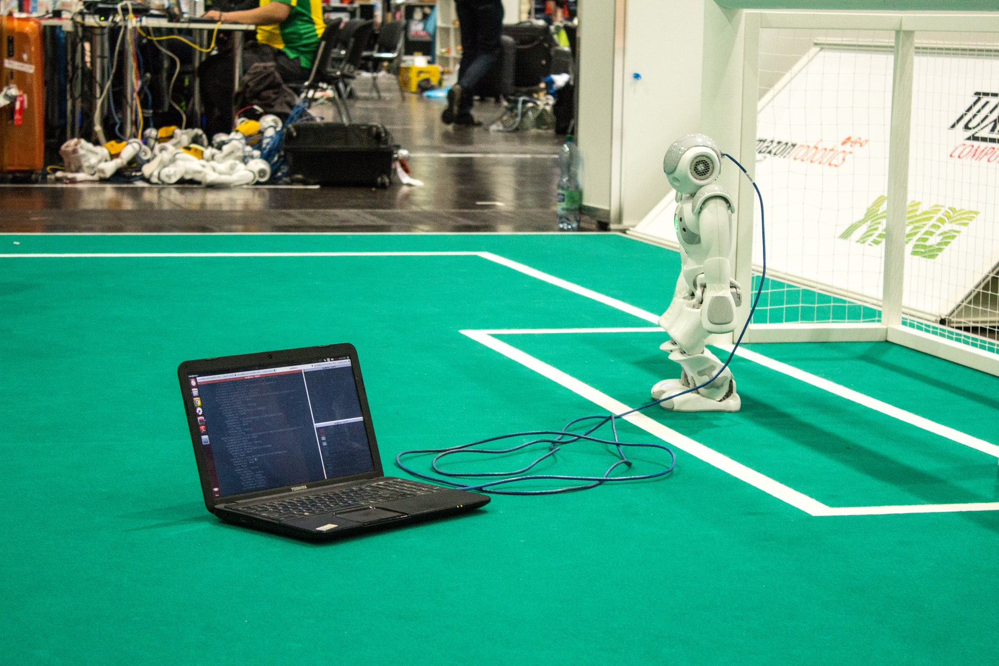

## A Quick Introduction to Power Platform RPA

**Workflows** and the more recent **Power Automate (Flows)** are traditional tools for automating business tasks after being triggered by an event or a recurring timer. Setting default field values in Dynamics 365, sending automated emails, creating scheduled tasks and so forth. 

**UI Flows** is a more recent tool for the Power Platform that brings **Robotic Process Automation (RPA)** capabilities. 

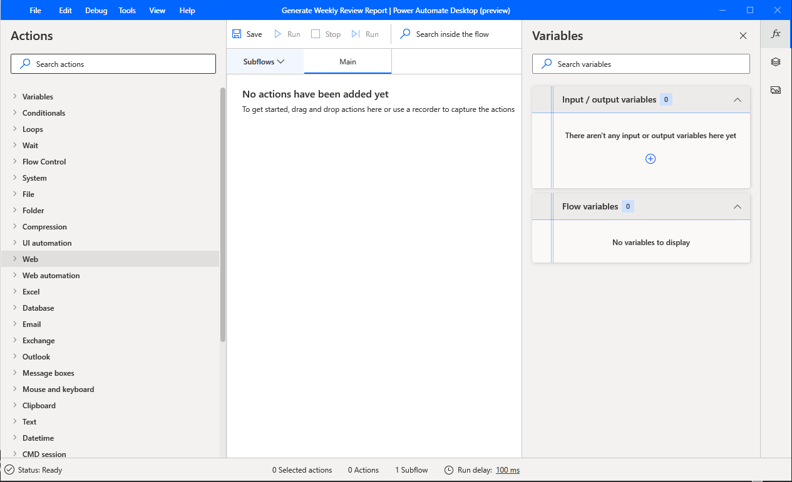

Robotics are of course commonplace in many industries such as manufacturing; from producing cars to computer hardware, robots automate repetitive, labour intensive tasks to free up workforce resources. And to look cool in the background of Tesla marketing videos. 

Now RPA - in the form of UI Flows - is growing on the Power Platform and finding its use by automating reptitive tasks in web applications such as **Dynamics 365**. And crucially, it doesn't require code and can be utilised by non-technical users. It works by simply **recording and replaying a set of point and click actions**. 

> There are also tools available besides 'point and click record' which will be covered in a separate article.

## Who can benefit from UI Flows?

Throughout the life of a Dynamics 365 project and implementation, many repetitive and sometimes tedious tasks are carried out by project stakeholders (**developers**, **testers**, **managers** and **users** alike). 

These tasks could be **post-release checks**, **weekly report generation** or **smoke testing features end-to-end** and become muscle memory, habit or even daily/weekly chores. 

Said stakeholders may even be aware of tools such as **EasyRepro**, **Power Automate** and **Azure DevOps pipelines**, which can help in situations such as these by automating tests and scheduled processes.

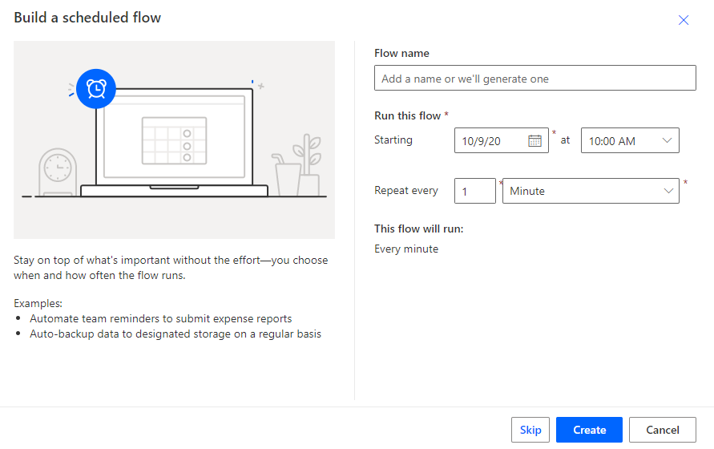

 _But_:

 - UI tests can be a hard sell on a project: EasyRepro need developer skills, and mainining these tests can prove time consuming (see: costly)
 - Power Automate, while providing an easy-to-use interface, requires a degree of training to get started

 **UI Flows** on the other hand, work by **simply recording user input** in the newly released [**Power Automate Desktop** application for Windows](https://docs.microsoft.com/en-us/power-automate/ui-flows/desktop/introduction).

Let's take a look at some potential real world uses for UI Flows.

#### Scenario #1: weekly report generation

As a food critic, I store my reviews in Dynamics 365 so I can report on where the best food is. **Every Friday I export the same report** of my review data **to an Excel file** and send it to a local magazine. 

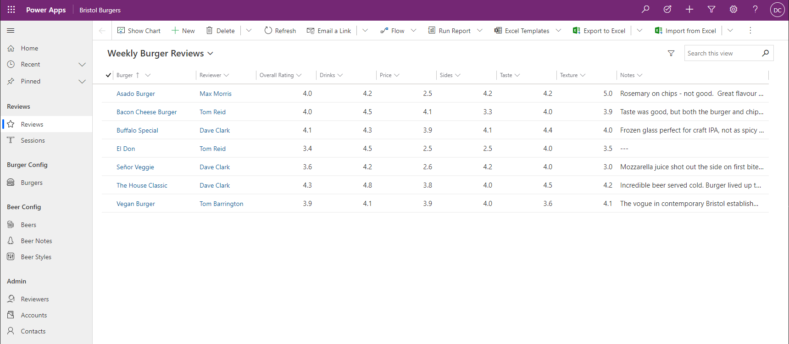

Again, automatically  generating reports can be achieved in numerous ways e.g. Excel connectors in Power Automate and tasks in DevOps. 

UI Flows offers a quick and easy, point and click, code-free solution to this problem. 

> Read below for my experience building this exact scenario with UI Flows!

#### Scenario #2: end-to-end testing critical features

As a systems tester, I want to **test** that the core sales process works as intended **after each Dynamics 365 solution release to Production**, to prove the release hasn't introduced any **regression bugs**.

**Releasing new configuration changes** can introduce bugs and break processes. The only sure-fire way to know, is to test said processes. 

These tests or _"smoke tests"_ are often performed after a release, sometimes late at night or over the weekend. With UI Flows, these tests can be **recorded once** and **performed multiple times**, even with randomised [data inputs](https://docs.microsoft.com/en-us/power-automate/ui-flows/inputs-outputs-web) stored as variables (read below). 

#### Scenario #3: double checking environment variables

As a product owner, I want to ensure **[environment variables](https://docs.microsoft.com/en-us/powerapps/maker/common-data-service/environmentvariables)** are set to their expected values after each Dynamics 365 solution release to Production, so that dependent processes work as intended.

Environment variables shouldn't be used to store sensitive information, but are often used to store critical information:

- API URLs
- Client-side script depencies such as configurable JSON files
- Parameters for solution components

These variables can be overwritten with solution releases, causing any dependent processes (e.g. API calls) to fail. Parameterising environment variable values in UI Flows is a code-free solution for ensuring values are set as expected after each release.

> Setting environment variables is now easier than ever with Wael Hamze's [Power DevOps Tools](https://marketplace.visualstudio.com/items?itemName=WaelHamze.xrm-ci-framework-build-tasks) Update Environment Variables (preview) task for Azure DevOps.

## Creating a Power Automate Desktop UI Flow

If any of the above scenarios caught your interest, read on for my experience building an **automatic report generation** example using **Power Automate Desktop** and **UI Flows**.

### Gotchas

Installing Power Automate Desktop was reasonably straightforward. I followed [this guide](https://docs.microsoft.com/en-us/power-automate/ui-flows/desktop/introduction) from the Microsoft docs website. 

> Note: pay close attention to the section on [WinAutomation tool](https://www.winautomation.com/download/).

_However_, there were some 'gotchas' during my installation and first play through which could be worth sharing.

**Looking for the Web/Desktop Recorder button?**

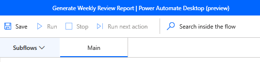

In the screenshot above, the record buttons are hidden because the application isn't maximised. When **resizing the application laterally**, the record buttons make an appearance (see below).

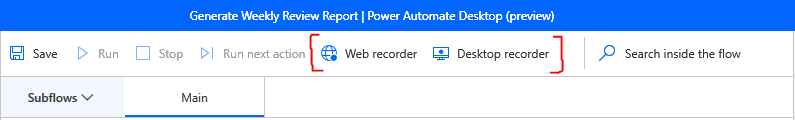

> Alternatively, select 'Tools' from the menu bar at the top to select either recording button.

**Unable to open the application/sign in?**

When first opening the application, Power Automate Desktop had trouble sigining me in due to having multiple accounts signed in on my local machine.

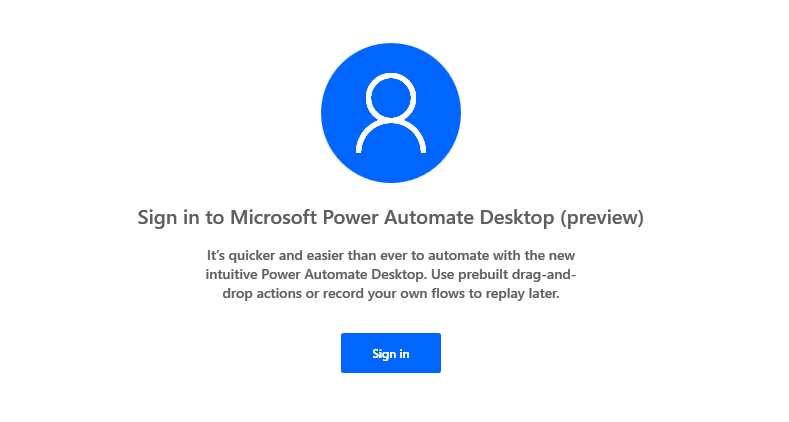

The solution for me was to open UI Flows from [make.powerapps.com](https://make.powerapps.com), where I was already signed in.

**Enabling browser extensions**

During the install process you're prompted to install browser extensions for:

- UI flows in Microsoft Power Automate
- Microsoft Power Automate Desktop
- Selenium IDE

Make sure you also enable these extensions in your browser of choice (I'm using Chrome below).

Settings > Extensions > Details > Enable

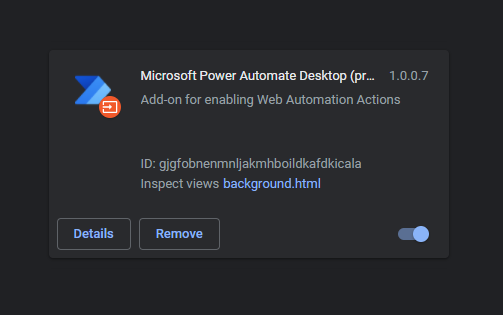

**From there, the rest was simple**. 

I opened the Power Automate Desktop application and hit **Web recorder**.

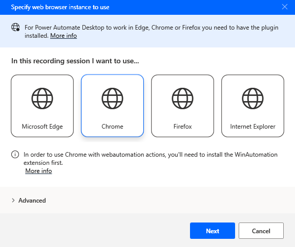

> Note: I've since come to prefer dragging in the action 'Launch new Chrome' from the left actions bar as this allows me to specify an initial URL.

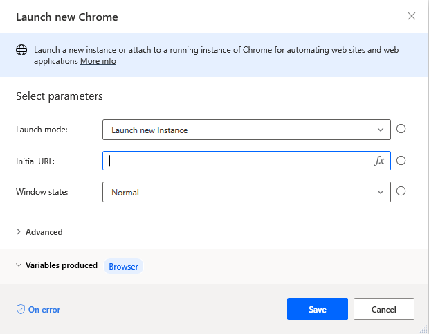

#### Recording the scenario

From here, I **recorded my steps** carrying out scenario 1 outlined above. As a refresher, this scenario/example is:

1. Opening Dynamics 365 to my specified model-driven app (Bristol Burgers)
2. Selecting 'Reviews' from the left navigation pane, and changing the view to 'Weekly Burger Reviews'

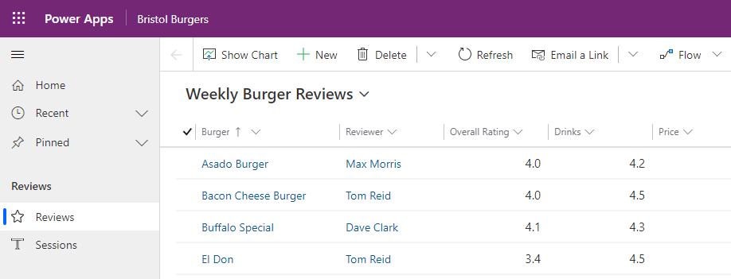

3. Exporting the reviews to Excel
4. Cutting the Excel file from downloads to my OneDrive folder.

Once recorded, the main window in Power Automate Desktop is **filled with auto-created actions** based on my point and click actions. 

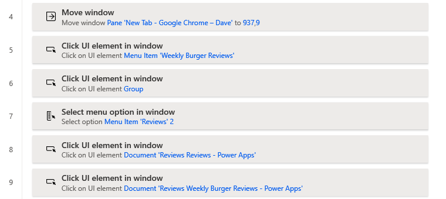

Now that the steps are saved, they can be repeated by pressing **Run** in the toolbar. 

> UI Flows can also be run remotely using the [on-premises data gateway](https://docs.microsoft.com/en-us/power-automate/ui-flows/setup#install-the-on-premises-data-gateway), a topic for another article.

That's one less admin task for me to worry about each week! Next week I can press run, go and make a coffee and return to my desk to find the report waiting in my OneDrive folder.

### Conclusion

**UI Flows bring robotic process automation to a wider audience**. 

The key driver for Microsoft here is **accessibility**: previously automation has been dependent on project budget and limited by technical skills. Admin users carrying out repetitive tasks, non-technical users day dreaming of process automation and stakeholders across a Dynamics 365 project now have the **power to create no-code point and click solutions that automate tasks** and free up time and resources.

**What repetitive tasks have you come across in Dynamics 365?** Let me know what you think on [Twitter](https://twitter.com/DaveClarkIO) or [LinkedIn](https://www.linkedin.com/in/davidjbclark/).
