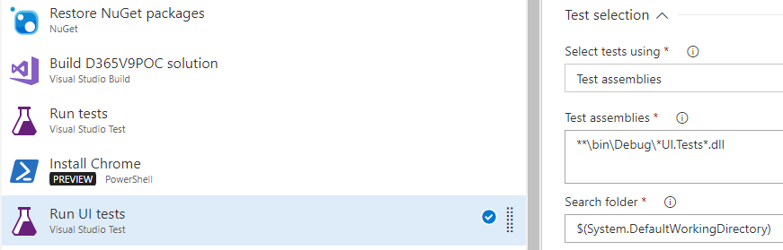
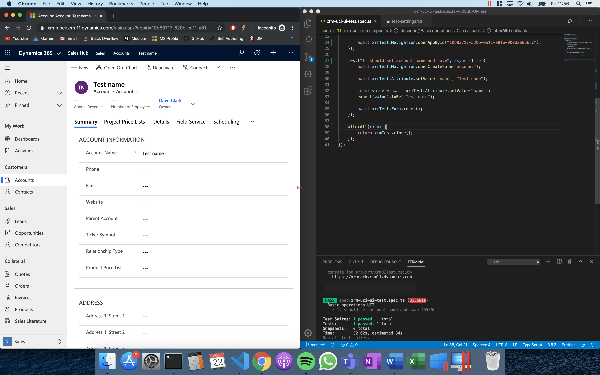

<div class="heading">

</div>

Most of us have heard of automation testing on the Power Platform by now. But it doesn't seem like everyone's <i>actually</i> been able to put the tools into practice. This series goes beyond the introductory how-to guides (valuable as they are) to consider obstacles preventing your organisation from upgrading to automation and, crucially, suggests measures to overcome them.

<h2>
Who should read this?
</h2>

Perhaps you’ve read [my previous](https://daveclark.io/article/30-04-18) or [Wael Hamze’s](https://waelhamze.wordpress.com/2018/01/04/ui-automation-for-dynamics-365-ce-easyrepro-part-2/) EasyRepro get started guides, or watched [Mohamed Radwan’s](https://www.youtube.com/watch?v=ryWgK34Akt0) UI test introduction video. You know the tools are out there, maybe you have the skills to write the tests yourself, but for one reason or another you still don’t find your team automating tests for Dynamics 365, Portals and PowerApps.

Perhaps you’ve overcome one or more of the fears laid out here, in which case you can nod along knowingly and join the discussion; sharing you own experience. Let's start from the top.

<h2>
1. Selenium is too complex
</h2>

To begin with the basics, a common concern is that automating UI actions with Selenium is too complex. Selenium works through its “WebDriver”; allowing programmers to interface with a web browser by automating keyboard input and point and click mouse actions to selected HTML elements. Writing tests with Selenium requires the programmer to find and maintain these HTML element selectors, such as:

<ul>
<li>Dynamics 365 command buttons</li>
<li>Office 365 login prompts</li>
<li>lookup field search icons</li>
<li>... and more</li>
</ul>

The list is extensive, and moreover the attribute used to select these HTML elements has been known to change between product versions (hence find <i>and maintain</i>).

In 2016 the [EasyRepro](https://github.com/microsoft/EasyRepro) project landed on <b>GitHub</b>; an open-source project from Microsoft that facilitates automation testing for Dynamics with a structured API that covers core commands. Here’s an example of a lead being qualified while I’m away from my keyboard making a cup of tea:

<video width="100%" controls>
<source src='https://i.imgur.com/Y96ENKF.mp4' type="video/mp4">
</video>

<b>EasyRepro</b> has been embraced by the open-source community: the project is updated regularly and there’s a [support network to resolve issues](https://github.com/microsoft/EasyRepro/issues), should you encounter any. There are also several walkthroughs on how to get started, such as [this get started guide from Wael Hamze](https://waelhamze.wordpress.com/2018/01/04/ui-automation-for-dynamics-365-ce-easyrepro-part-2/).

So we’ve addressed the concern of Selenium’s complexity with EasyRepro, but <u>we’re still left having to write C# code</u> to automate our UI tests. If this is also a concern, then read on.

<h2> 
2. Our testing team isn't proficient in C#
</h2>

Our testing team is fantastic at testing; systematic, professionally pedantic and efficient at making things fall over. They’re familiar with the nuances of our product offerings and pick holes in the finer details of customisations, leading to higher quality software being delivered to our customers. But they aren’t proficient in C#.

Conversely our C# developers aren’t efficient at testing, and often wrote the code that needs to be tested. The question is then:

<b>How do we merge skillsets in a way that is productive and feasible?</b>

How do we approach both teams working closely together: testers providing the human eye and developers applying their C# experience to automate UI tests?

<b>Behaviour-driven development (BDD)</b> addresses this. It's a development approach that encourages collaboration between tech and non-tech stakeholders. It achieves this collaboration by writing tests before the coding begins, in a language that is user-focused and easy to understand. BDD is nothing new, but it is somewhat new for Dynamics 365 development.

<b>How does BDD work with Dynamics 365?</b>

In BDD, tests begin their journey as a <b>scenario</b> specifying some behaviour of the system. A scenario in Dynamics 365 might look like:

```
Feature: Lead qualification

	In order to qualify a lead as representing a potential deal
	As a sales executive
	I want to be able to qualify a lead to an opportunity

Scenario: Qualify a lead

	Given I login to CRM
	When I open a lead record
	And I qualify the lead
	Then an opportunity record should be created
```

<b>How is a test scenario automated?</b>

Using a tool like [SpecFlow](https://specflow.org/), we can bind each line of our scenario to a block of C# code written against the EasyRepro API. So “Given I login to CRM” would be handled in code by opening a web browser, navigating to an application’s URL and logging in.

```cs
[Binding]
public sealed class Login : XrmBinding
{
    [Given(@"I am logged in to CRM as (.*)")]
    public void GivenIAmLoggedIntoCrmAs(string userAlias)
    {
        XrmApp.OnlineLogin.Login(TestSettings.CrmUrl,TestSettings.Username, TestSettings.Password);
    }
}
```

<b>Part 2 of this series takes a deeper look at BDD</b>, going step-by-step through a working scenario and supporting source code. If you think BDD has potential to add value to your projects, then part 2 will ensure you have everything you need to get started.

<h2>
3. UI tests take too long to run
</h2>

If you’ve ever run a UI test, you’ll know that they can take some time to fully execute. A suite of test scenarios executing on your machine can sink hours of your time and hog system resources while you twiddle your thumbs patiently.

Fortunately, an update to EasyRepro in early 2018 added [headless Chrome](https://developers.google.com/web/updates/2017/04/headless-chrome) compatibility, meaning we can run our automatic UI tests from a Chrome browser on another machine, namely an [Azure pipeline agent](https://docs.microsoft.com/en-us/azure/devops/pipelines/agents/agents?view=azure-devops). We can configure the agent to run the tests at different times too, such as when a code pull request is created, or scheduled to run nightly. Running UI tests nightly has the benefits of:

<ul>
<li>offsetting the burden of UI tests taking a while to run by executing them on cloud resources outside of peak times</li>
<li>providing an email summary of failed tests each morning, specifying areas of regression introduced to the system by code changes made the day before</li>
</ul>

If you’re interested in configuring your UI tests to run automatically from Azure, [my previous post](https://daveclark.io/article/30-04-18) covers a step-by-step to pipeline agent configuration.



<h2>
4. UI tests lack traceability
</h2>

A common complaint levelled against UI tests is their lack of traceability. <b>If a suite of UI tests is run overnight, what feedback do we receive from our virtual machine’s console?</b> Is the information provided sufficient to pass to the development team for fixing?

When a human tests a system’s behaviour they can:

<ul>
<li>note the exact area of the system at fault and provide steps to reproduce</li>
<li>associate the defect with a test case or a user story</li>
<li>screenshot or record the error message</li>
</ul>

<b>We should expect nothing less from automation if we’re going to consider it feasible</b>. The bad news is, by running EasyRepro out-of-the-box, your error logs won’t provide as much detail in your defect reports as a human can. The good news is there are tools available that address this, allowing you to configure EasyRepro to:

<ul>
<li>produce a test run report using <a href="http://extentreports.com/">ExtentReports</a></li>
<li>capture a video from a test run</li>
<li>capture a screenshot when a test fails</li>
</ul>

At the risk of regurgitating an already well written how-to guide, I'll defer the specifics to Jason Lattimer's [reporting on EasyRepro test runs](https://jlattimer.blogspot.com/2019/06/reporting-on-easyrepro-test-runs.html) post from June. Jason's post details how to build the above three points in your automation tests and provides [supporting source code](https://github.com/jlattimer/EasyReproExtentReports).

Fortunately the effort for configuring these tools in your tests is a one-off "fire and forget" rather than having to configure them manually for each test. But, it's <i>still more C#</i> code that needs writing and maintaining. The next point looks to address this and offers a new alternative.

<h2>
5. It's not feasible to maintain another C# repository
</h2>

It't not often that a Microsoft software house is short of C# .NET developers. But what if the C# developers are flat out on other work ? Maybe <b>we have a team of front-end developers who could get involved in writing automation tests</b> if only there was a tool they could use written in their preferred language of JavaScript or TypeScript.

<b>Well there are alternatives to the C# world of EasyRepro!</b>

One emerging project is Florian Krönert's [D365-UI-Test](https://github.com/DigitalFlow/D365-UI-Test) which is described as:

> An unopinionated UI testing library for Dynamics 365 CE and Dynamics Portals. Powered by TypeScript and Puppeteer.

Whereas EasyRepro simulates user input by interacting with HTML DOM elements, D365-UI-Test interacts with the Dynamics 365 and Portals interface (yes it works with Portals) via the <b>Xrm namespace</b>. This means:

<ul>
<li>developers with a knowledge of the widely used <a href="https://docs.microsoft.com/en-us/dotnet/api/microsoft.xrm.sdk?view=dynamics-general-ce-9">Xrm namespace</a> can contribute to the project and add their own bindings</li>
<li>the project requires less maintenance than EasyRepro, as the Xrm namespace will change less than Dynamics 365's DOM element selectors</li>
</ul>

<b>How does it work?</b>

First the package is installed in your JavaScript or TypeScript test project using:

```
npm install d365-ui-test
```

Then install your preferred testing framework if one isn't already installed such as [Jest](https://jestjs.io/).

Now you can write your tests against the bindings available so far.

Here's an example that:

<ul>
<li>logs into a Dynamics 365 environment</li>
<li>navigates to a specified model-driven app</li>
<li>creates a new account record</li>
<li><b>asserts</b> that the name of the account record was changed successfully</li>
</ul>

```ts
test("It should set account name and save", async () => {
  await xrmTest.Navigation.openCreateForm("account");

  await xrmTest.Attribute.setValue("name", "Test name");
  await xrmText.Entity.save();

  const value = await xrmTest.Attribute.getValue("name");
  expect(value).toBe("Test name");

  await xrmTest.Form.reset();
});
```

Running the test command `npm run test` specified in `package.json` opens a browser window and automatically runs the test:



This project is in its infancy, but as you've seen it can already execute the basics of logging in, changing app and setting string fields. It can also:

<ul>
<li>set other basic field data types</li>
<li>read values and assert against them</li>
<li>assert visibility and read only states</li>
</ul>

So, you probably already knew Florian Krönert as the author of [Xrm-WebApi-Client](https://github.com/DigitalFlow/Xrm-WebApi-Client). If <b>writing automation tests in TypeScript for Dynamics 365 and Portals sounds interesting</b>, consider checking out his new [D365-UI-Test](https://github.com/DigitalFlow/D365-UI-Test) project and even contributing!

<h2>
Conclusion
</h2>

Automation testing is <b>the future</b> of ensuring solutions built on Microsoft's Power Platform are <b>built to specification</b> and <b>free from ongoing regression defects</b>.

The tools available to teams building these solutions have become well known; EasyRepro is widely reported on by the community and has been further showcased by this article.

However, even armed with these tools, <b>teams face challenges actually putting these tools to use</b>, such as cultural misunderstanding of the approach required to make automation successful, or failure to sell the benefits of automation testing to senior project stakeholders.

This post has addressed the five main fears that I've seen facing teams of developers as they look to automate their testing pipeline for customisations on the Power Platform.

What do <u>you think</u>? Can you name five more?
